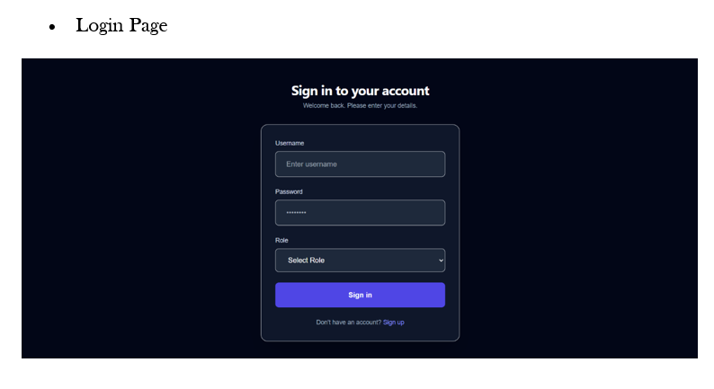
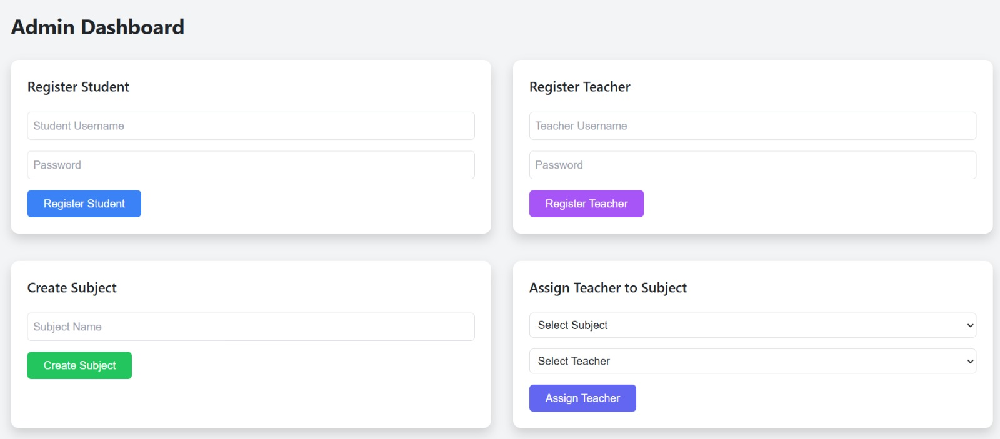
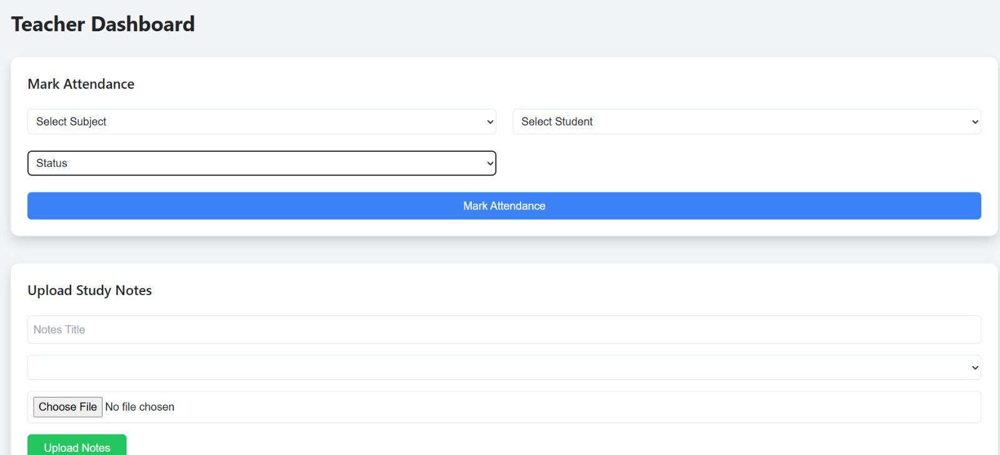
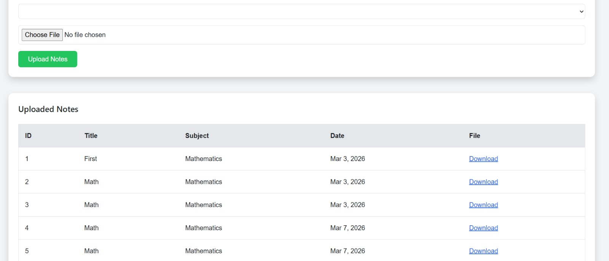
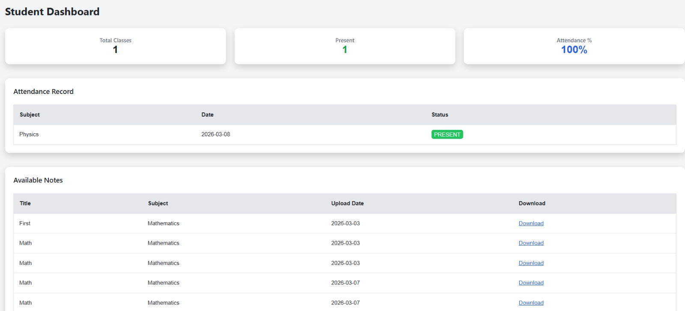

# Student Management Frontend

A production-oriented Angular 19 frontend for a role-based student management system. The application provides separate flows for administrators, teachers, and students, with SSR support, authenticated dashboard access, attendance workflows, and notes management.

## Overview

This project is the frontend client for a larger Student Management System. It is designed to work with a separate backend service running on `http://localhost:8080` and exposes distinct user experiences for three roles:

- Admin: create users, create subjects, assign teachers, and manage platform data
- Teacher: mark attendance, upload notes, view assigned students and subjects
- Student: view attendance, access uploaded notes, and download learning material

The app uses Angular standalone components, Angular SSR, Bootstrap, Angular Material, and a template-driven UI layer for a modern dashboard experience.

## Key Features

- Role-based login flow with JWT token storage
- Dedicated dashboards for admin, teacher, and student users
- Attendance tracking and summary display
- Notes upload and download support
- Subject and teacher assignment flows for admins
- SSR-enabled Angular application with browser-only guards where required
- Unit test coverage for core component bootstrapping

## Screenshots

This section includes screenshots of important system pages.

### Login Page



### Admin Dashboard



### Teacher Dashboard



### Notes Upload Page



### Student Dashboard



## Tech Stack

| Layer | Technology |
| --- | --- |
| Framework | Angular 19 |
| Rendering | Angular SSR |
| UI | Bootstrap 5, Angular Material |
| Forms | Angular Forms |
| HTTP | Angular HttpClient + interceptor |
| Styling | Global template CSS + app styles |

## Application Routes

| Route | Description |
| --- | --- |
| `/` | Landing page |
| `/login` | Authentication screen |
| `/admin` | Admin dashboard |
| `/teacher` | Teacher dashboard |
| `/student` | Student dashboard |

## Project Structure

```text
src/
	app/
		app.component.ts                Root app shell
		app.config.ts                   Global providers and HTTP interceptor setup
		app.routes.ts                   Route configuration

		auth/
			login/                        Login component

		admindashboard/                 Admin dashboard and admin API service
		teacherdashboard/               Teacher dashboard and teacher API service
		studentdashboard/               Student dashboard
		home/                           Landing page
		interceptors/                   Auth interceptor

	assets/
		template/                       Template styles and static assets

public/
	assets/                           Publicly served assets
```

## Prerequisites

Before running the frontend, make sure the following are available:

- Node.js 20.x or later recommended
- npm
- Angular CLI
- Backend service running separately on `http://localhost:8080`

Install Angular CLI globally if needed:

```bash
npm install -g @angular/cli
```

## Getting Started

### 1. Install dependencies

```bash
npm install
```

### 2. Start the development server

```bash
npm start
```

Open the app in the browser:

```text
http://localhost:4200
```

### 3. Run the unit tests

```bash
npm test
```

For a single headless run:

```bash
npx ng test --watch=false --browsers=ChromeHeadless
```

### 4. Build for production

```bash
npm run build
```

### 5. Run the SSR server after build

```bash
npm run serve:ssr:student-frontend
```

## Available Scripts

| Command | Purpose |
| --- | --- |
| `npm start` | Starts Angular development server |
| `npm run build` | Creates production build |
| `npm run watch` | Builds in development watch mode |
| `npm run serve:ssr:student-frontend` | Serves the SSR build |

## Backend Integration

The frontend expects a separate backend running on:

```text
http://localhost:8080
```

Current API areas used by the frontend include:

- `POST /auth/login`
- `/admin/...`
- `/teacher/...`
- `/student/...`

If the backend is not running, authentication and dashboard data-loading requests will fail.

## Authentication Flow

- The login screen posts credentials to the backend
- On success, a JWT token is stored in `localStorage`
- An HTTP interceptor attaches the token to authenticated requests
- Dashboard components read protected resources based on the logged-in role

## SSR Notes

This project is configured with Angular SSR. Because of that:

- Browser-only code must be guarded before using `window`, `document`, or `localStorage`
- Components that depend on browser APIs should check platform context before running client-only logic
- Backend-dependent data loading should not assume SSR has access to browser storage

## Development Notes

- The app uses standalone Angular components instead of a traditional NgModule-based structure
- Bootstrap CSS and JS are included through Angular configuration
- Global template styling is loaded from `src/assets/template/css/styles.css`
- Some dashboard API calls are currently placed directly in components rather than in shared feature services

## Validation Status

The current frontend state has been verified locally with:

- `npm run build`
- `npx ng test --watch=false --browsers=ChromeHeadless`

## Common Issues

### Backend not reachable

Symptoms:

- Login fails
- Dashboard tables stay empty
- Requests show connection refused in browser devtools

Fix:

- Start the backend service
- Confirm it is running on port `8080`
- Confirm backend CORS allows `http://localhost:4200`

### SSR errors from browser APIs

Symptoms:

- Build fails with `localStorage is not defined`

Fix:

- Guard browser-only code with platform checks before using browser globals

### Dependency or cache issues

Try a clean reinstall:

```bash
rm -rf node_modules .angular
npm install
```

On Windows PowerShell:

```powershell
Remove-Item -Recurse -Force node_modules, .angular
npm install
```

## Future Improvements

- Move dashboard HTTP logic into clearer feature services
- Add route guards based on authentication and role
- Add stronger error handling and toast feedback for API failures
- Expand unit and integration test coverage
- Introduce environment-based API configuration instead of hardcoded local URLs

